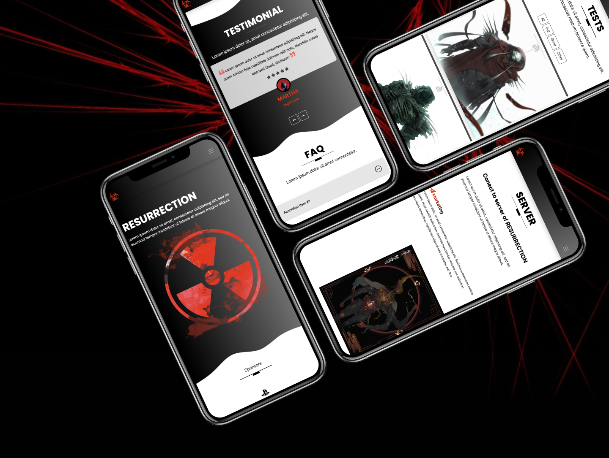

# RESSURECTION :boom:

## Description
Thanks to the freeCodeCamp.org tutorial, I was able to create a very large website project using the SASS preprocessor. In addition to the standard use of HTML/CSS, we are also introducing SASS capabilities. Thanks to it, not only our CSS code will be easier for us to write, it will also speed up our work, so it is worth learning it and checking what possibilities it has :muscle:

## Link to tutorial :tv:

- [freeCodeCamp.org](https://www.youtube.com/@freecodecamp)

>[Learn Bootstrap 5 and SASS by Building a Portfolio Website - Full Course](https://www.youtube.com/watch?v=iJKCj8uAHz8&t=13530s&ab_channel=freeCodeCamp.org)
## Technologies used
- HTML
- CSS
- SASS
- Bootstrap

# My Portfolio :smiling_imp:
- [Behance](https://www.behance.net/karolkomor1b9a) :computer:

- [Github](https://github.com/FLaMeREVENGE) :paw_prints:

